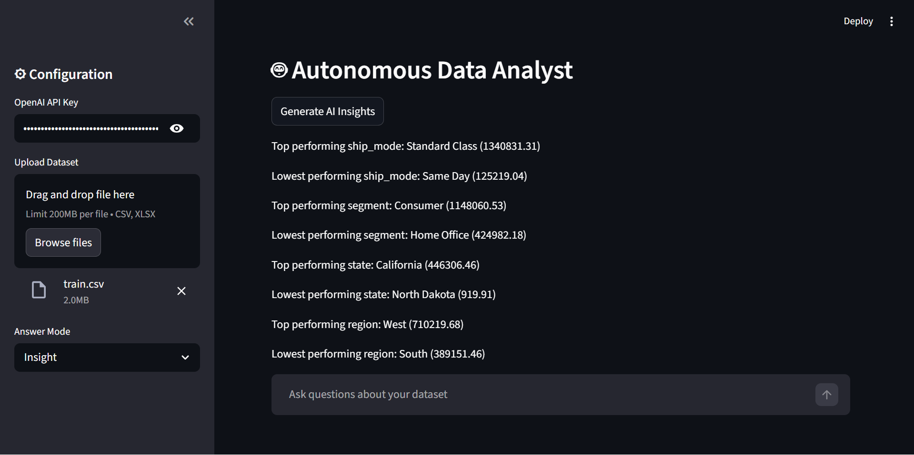
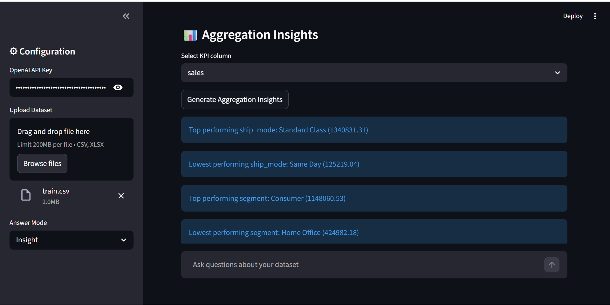
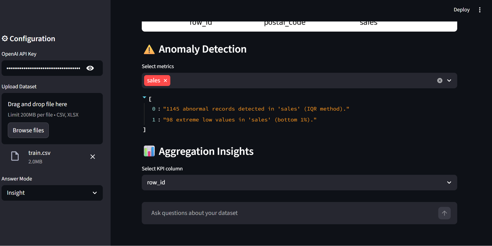
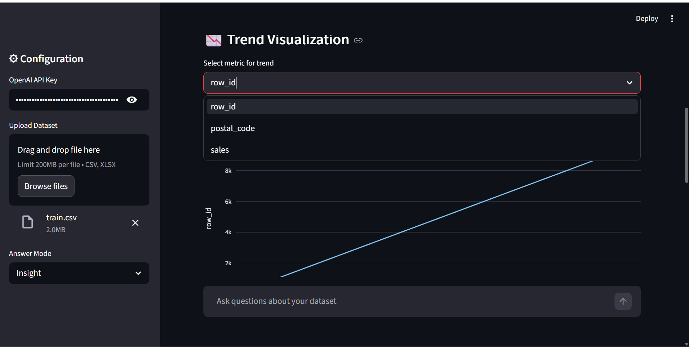
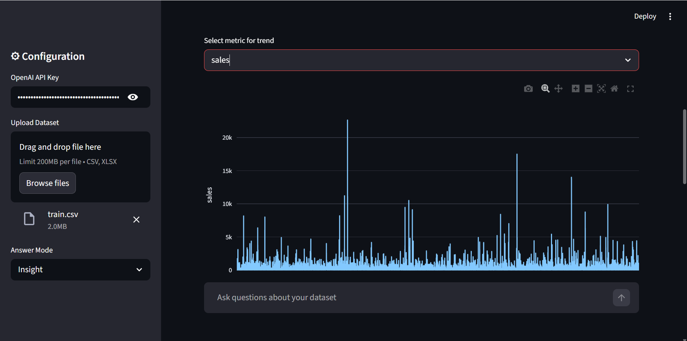
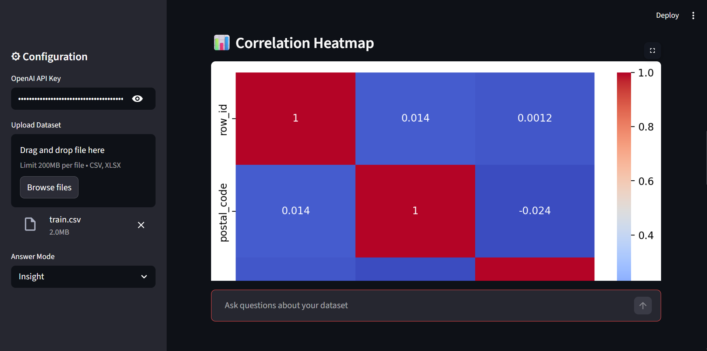

📊 AI Financial Intelligence Engine

AI Data Analytics Project combining:

• Artificial Intelligence
• Business Intelligence
• Autonomous Agents
• Financial Data Analysis
PowerBI + ChatGPT + Autonomous Data Analyst

This project is an AI-powered data analysis tool.
It allows users to upload a dataset and ask questions in normal English.
Instead of writing SQL queries or building dashboards manually, the system automatically:

✔ Understands the question
✔ Converts it into a SQL query
✔ Analyzes the dataset
✔ Generates insights
✔ Creates charts and dashboards

In simple words, it works like having your own AI Financial Analyst.

🚀 What This Project Does

Normally, analyzing data requires:
• Writing SQL queries
• Using tools like PowerBI
• Creating charts manually

But with this system, you can simply ask questions like:

What is the total sales?
Which region has the highest revenue?
Top 10 customers by sales
Which product sold the most?
Show sales trend by year

The system will automatically show:

✅ The correct answer
✅ The SQL query used
✅ Table results
✅ Charts and dashboards
✅ Business explanation of the result

🖥 Application Interface
This is the main interface where users upload the dataset and ask questions.

📂 Dataset Preview and Auto Analysis

After uploading a dataset, the system automatically shows:

• Top rows of the dataset
• Basic analysis of the data

---

🤖 Autonomous AI Insights
The system can automatically generate insights from the dataset.

📊 Auto Aggregation Insights

The AI can automatically summarize important metrics from the data.

Example:
• Sales aggregation
• Category analysis

---

⚠️ Auto Anomaly Detection

The system can detect unusual patterns or anomalies in the data.

---

📈 Automatic Trend Visualization

The system can automatically generate trend charts.

Example:
• Sales growth over time
• Monthly performance

---

🔥 Correlation Analysis

The system can also analyze relationships between different variables.

---

💬 Asking Questions in Insight Mode

Users can ask questions directly to the AI analyst.

Example:
Average sales by segment

🧠 Result in Insight Mode

The AI explains the result in simple business language.
Example explanation:
> "Consumer segment shows the highest average sales compared to other segments."

---

🧾 SQL Mode

Users can also see the SQL query generated by the AI.
This is helpful for people learning SQL.

---

📊 Dashboard Mode
The system can also create a dashboard visualization for the asked question.

---

📉 Final Dashboard Visualization
Charts are automatically generated for better understanding.

---

🧠 How the System Works

The system follows a simple process:

User asks a question
        ↓
AI understands the question
        ↓
SQL query is generated
        ↓
Dataset is analyzed
        ↓
Results are returned
        ↓
Charts and insights are created

The user only needs to ask questions about the dataset.

---

🏗 System Architecture

User Question
      ↓
Query Planner
      ↓
SQL Generator
      ↓
SQL Engine
      ↓
Dataset Analysis
      ↓
Insights + Charts

---

📂 Project Structure

project_root
│
├── core
│   ├── agents
│   │   ├── financial_agent.py
│   │   ├── query_planner.py
│   │   ├── agent_executor.py
│   │   └── memory.py
│   │
│   └── engines
│       ├── sql_engine.py
│       ├── aggregation.py
│       ├── anomaly_detector.py
│       ├── correlation.py
│       ├── financial_analyzer.py
│       ├── metric_engine.py
│       └── time_analyzer.py
│
├── dashboard
│   ├── charts.py
│   ├── kpi_cards.py
│   └── auto_insights.py
│
├── data_preprocessing
│   ├── load_data.py
│   ├── clean_data.py
│   ├── describe_data.py
│   └── preview_data.py
│
├── reporting
│   └── report_generator.py
│
├── utils
│   ├── chart_generator.py
│   └── column_classifier.py
│
├── Screenshots
│
├── app.py
├── main.py
└── requirements.txt

---

⚙️ Technologies Used

This project uses modern AI and data tools.

Technology	Purpose

Python	Core programming
Pandas	Data analysis
Streamlit	Web application
Plotly	Interactive charts
Seaborn	Statistical visualization
pandasql	SQL queries on dataframe
OpenAI API	Natural language understanding

---

📊 Example Questions

Financial Questions
What is the total sales?
Average sales per order
Highest sales recorded

---

Customer Questions
Which customer ordered the most?
Top 10 customers by sales
Customer with least orders

---

Product Questions
Which product sold the most?
Top products by revenue
Most popular category

---

Time Analysis
Sales trend by year
Orders per month
Which month has the highest sales

---

🛠 Installation

Clone the repository
git clone https://github.com/Saalim02/financial-intelligence-engine.git
cd financial-intelligence-engine

---

Install dependencies
pip install -r requirements.txt

---

Run the application

streamlit run app.py

---

🔑 OpenAI API Setup
When running the application, enter your OpenAI API Key in the sidebar.

---

📈 Example Workflow

1️⃣ Upload a dataset (CSV / Excel)

2️⃣ Select answer mode

Insight
SQL
Dashboard

3️⃣ Ask questions about the dataset

4️⃣ The system automatically performs:

Question → SQL → Data Analysis → Insights → Charts

---

🎯 Why This Project Is Useful

This project helps people analyze data without needing technical knowledge.

Instead of learning:

• SQL
• Python
• Data visualization tools

Users can simply ask questions and get answers instantly.

---
